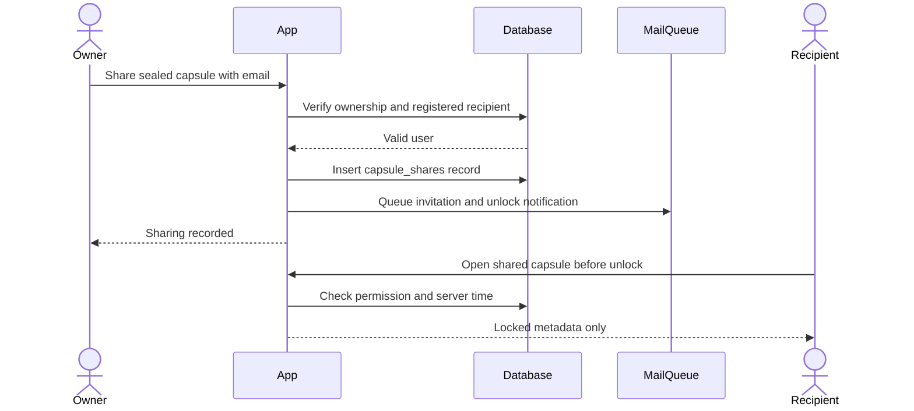
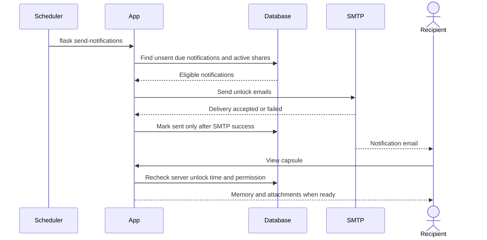
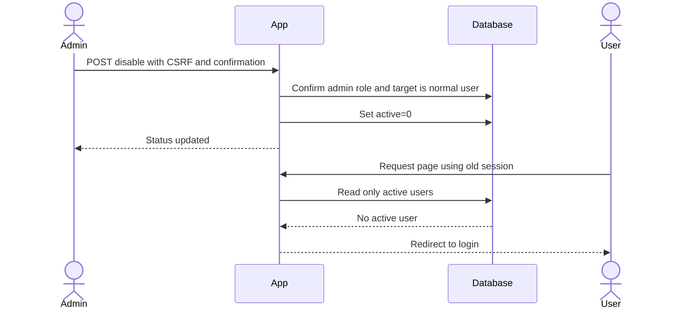

# Sprint 5 UML Sequence Diagrams

## Sharing a Locked Capsule

```mermaid
sequenceDiagram
    actor Owner
    participant App
    participant Database
    participant MailQueue
    actor Recipient
    Owner->>App: Share sealed capsule with email
    App->>Database: Verify ownership and registered recipient
    Database-->>App: Valid user
    App->>Database: Insert capsule_shares record
    App->>MailQueue: Queue invitation and unlock notification
    App-->>Owner: Sharing recorded
    Recipient->>App: Open shared capsule before unlock
    App->>Database: Check permission and server time
    App-->>Recipient: Locked metadata only
```

## Unlock Notification

```mermaid
sequenceDiagram
    participant Scheduler
    participant App
    participant Database
    participant SMTP
    actor Recipient
    Scheduler->>App: flask send-notifications
    App->>Database: Find unsent due notifications and active shares
    Database-->>App: Eligible notifications
    App->>SMTP: Send unlock emails
    SMTP-->>App: Delivery accepted or failed
    App->>Database: Mark sent only after SMTP success
    SMTP-->>Recipient: Notification email
    Recipient->>App: View capsule
    App->>Database: Recheck server unlock time and permission
    App-->>Recipient: Memory and attachments when ready
```

## Administrator Disables an Account

```mermaid
sequenceDiagram
    actor Admin
    participant App
    participant Database
    actor User
    Admin->>App: POST disable with CSRF and confirmation
    App->>Database: Confirm admin role and target is normal user
    App->>Database: Set active=0
    App-->>Admin: Status updated
    User->>App: Request page using old session
    App->>Database: Read only active users
    Database-->>App: No active user
    App-->>User: Redirect to login
```
